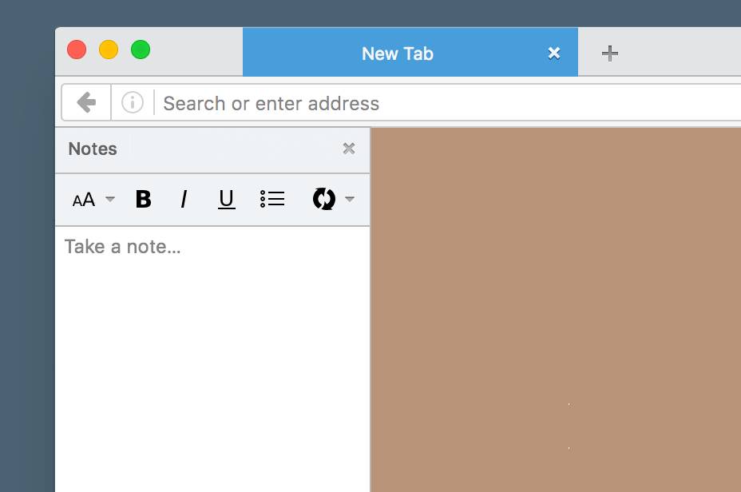

# Hoverpad



A persistent pad — click a button in your browser and add some notes,
which will persist even after browser restarts and be synced between
your browsers.

Works in Firefox 51+, as a Chrome extension, as a web, mobile and desktop app.

Try out [the demo](https://mozilla-services.github.io/hoverpad/)

## What it does

This extension includes:

* A browser action that creates a popup — within the popup is:
    * A form elements for entering the body text.

Hoverpad uses the WebExtensions
[Storage API](https://developer.mozilla.org/Add-ons/WebExtensions/API/storage)
to persist the notes encrypted.

## What it shows

* How to persist data in a WebExtension using the Storage Sync API.
* How to connect using Firefox Account in an addon
* How to build an extension with [Elm](http://www.elm-lang.org/)
* How to encrypt data using WebCrypto
* How to sync data and handle conflicts with Kinto

## How to try the add-on in Firefox?

### From addons.mozilla.org

Grab it from AMO: https://addons.mozilla.org/firefox/addon/hoverpad/

If you don't care about automatic updates, you can also install the
latest XPI from https://github.com/mozilla-services/hoverpad/releases

### From the source code

1. Go to `about:debugging`
2. Click the Load a temporary module
3. Select the manifest.json
4. You would need to do that each time you restart Firefox.
5. You can click on the `Refresh` button to change the files and reload the add-on.

## How to try the add-on in Chrome?

### From the Chrome Store

[Grab it from the Chrome Store](https://chrome.google.com/webstore/detail/hoverpad/kedanmokpljgpkgfojeoigehigpoljie)

### From the source code

1. Go to `chrome://extensions`
2. Tick the Developer Mode
3. Load the hoverpad repository folder.

## Desktop app

Using [Electron](http://electron.atom.io/), you can run the hoverpad as an
application on your desktop.

First install electron:

```sh
npm install -g electron
```

Then run the application:

```sh
npm run electron
```

## Mobile app

Using [Cordova](https://cordova.apache.org/), you can run the hoverpad
as an application on your mobile.

First install Cordova:

```sh
npm install -g cordova
```

Then add the platform(s) you'd like to support:

```sh
cordova platform add android
```

Then run the application (here on Android):

```sh
npm run cordova-android
```

## How to build the Chrome extension ``hoverpad.crx`` file?

Assuming the ``chromium-browser`` command is available in your ``PATH``:

```sh
npm run chrome-web-ext
```

## How to build the Chrome Store ``hoverpad.zip`` file?

```sh
npm run chrome-store-zip
```

## How to build the Firefox extension ``hoverpad.xpi`` file?

```sh
npm run fx-web-ext
ls hoverpad/web-ext-artifacts/hoverpad-*.zip
```
